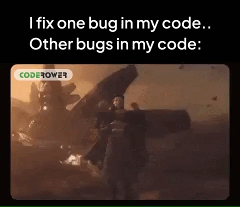

# 👀 Olá, espero que esteja bem! Me chamo Antonio Carlos, mas pode chamar de Carlos!

## Seja bem vindo! Aqui irei criar muitos projetos bacanas sobre testes de software! ❤❤
Atualmente me encontro como testador de software, onde desenvolvo minhas habilidades no dia-dia e também pensar como um líder, sempre buscando soluções práticas para aprimorar continuamente os processos, com foco na qualidade desde o início até o fim da entrega.

Construir algumas aplicações ao decorrer da minha jornada, quando iniciei em front-end em parceria com oracle, porém me encontrei em qualidade de software e atualmente estou construindo meu novo portifólio, para que seja apresentado para grandes empresas.

Qualidade é uma cultura é nós só confiamos naquilo que acreditamos e eu acredito na cultura da qualidade para o desenvolvimento de softwares estáveis que seguem os padrões de excelência exigidos pelo mercado.

### Projetos Pessoais em andamento

  
  

## Versionamento de código e repositório
 

## Como eu poisso entrar em contato ?
 

